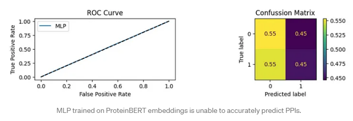
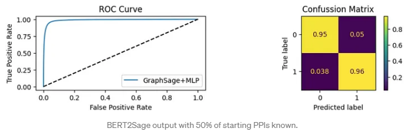

# Bert2Sage: Augmenting Graph Inductive Algorithms with Domain Specific Language Models

  
Follow the tutorial at:  [cs224W Media Post ](https://medium.com/stanford-cs224w/bert2mult-predicting-a-priori-protein-protein-interactions-with-graph-neural-networks-and-f257c8b575a0)

Proteins are essential for the functioning of all biological life, performing a wide range of tasks within cells, from enzymes that catalyze biochemical reactions to antibodies that recognize pathogen-infected cells. Protein-protein interactions (PPIs) play a crucial role in many of these processes, as proteins must bind and interact with other objects to achieve their purpose. However, predicting PPIs is a biologically complex problem that remains difficult to test in laboratory settings, and computational approaches are still in development. Recent advances in machine learning have enabled researchers to make significant strides in predicting protein folding, but accurately predicting PPIs remains a highly sought-after goal.

One reason to develop models that accurately predict PPIs involves leveraging previously validated interactions from well-studied organisms to predict interactions in newly sequenced organisms. Predicting PPIs a priori is especially important as researchers seek to understand previously uncharacterized organisms and the diversity of life more broadly. In this blog post, we describe a novel methodology for predicting PPIs in organisms using limited or no known PPIs from the same organism. We combine the power of Graph Neural Networks (GNN) with Large Language Models (LLM) to create accurate PPI predictions.

We tested two separate GNN architectures, GraphSAGE [1] and DistMult [2], and found that, in this application, DistMult provides higher accuracy predictions while also being able to make predictions a priori. Furthermore, we found that using LLMs in conjunction with GNNs improves the accuracy of PPI predictions compared to LLMs alone. We believe that our work represents a meaningful advancement in the way PPIs are predicted and hope that it will contribute to future developments in this important field.
 

Performance of Domain specific LLM without Graphsage: 

Performance of Domain specific LLM with Graphsage: 

